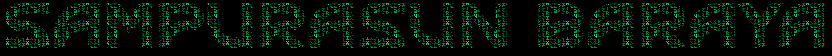

  

  

  <!-- Badge Full Stack Developer dan beberapa skill -->
  
  
  
  
  
  
  
  

  <picture>
    <source media="(prefers-color-scheme: dark)" srcset="https://raw.githubusercontent.com/Platane/Platane/output/github-contribution-grid-snake-dark.svg" />
    <source media="(prefers-color-scheme: light)" srcset="https://raw.githubusercontent.com/Platane/Platane/output/github-contribution-grid-snake.svg" />
    
  </picture>

  <b>Full stack Develover | Distro Hopper</b>

 

  

<text="Logo License</a> • All rights reserved"

